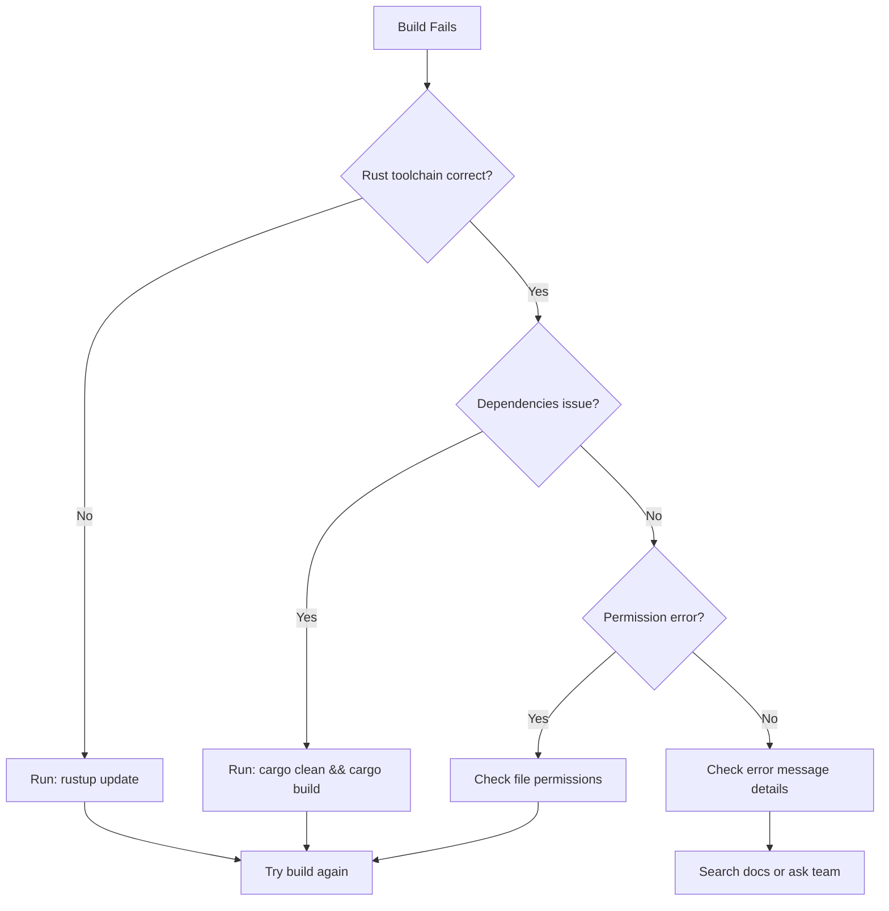
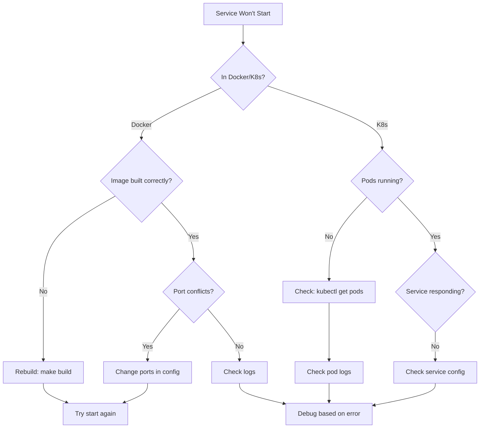
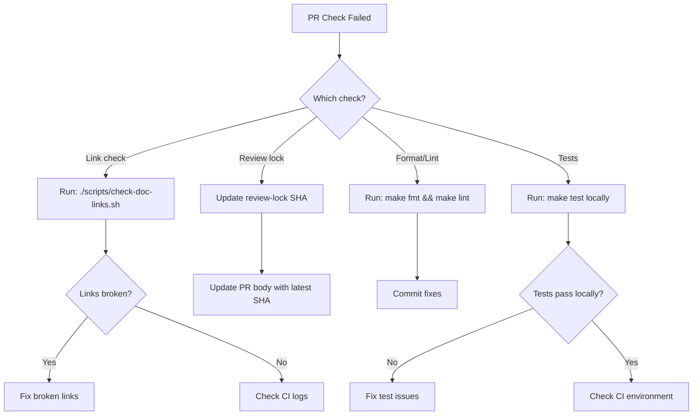
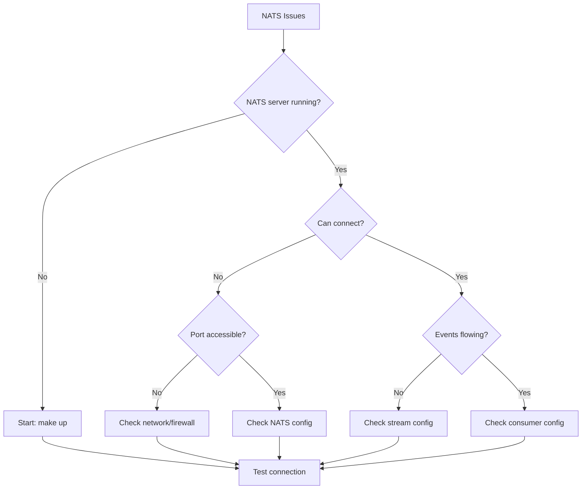

# Troubleshooting Decision Tree


Interactive guide to diagnose and resolve common Demon issues.

## 🔍 Start Here: What's the Problem?

### 1. Build/Development Issues
**Symptoms:** Build fails, tests don't pass, local setup broken
- ➡️ [Build Issues](#-build-issues)

### 2. Runtime/Production Issues
**Symptoms:** Services crash, pods not ready, API errors
- ➡️ [Runtime Issues](#-runtime-issues)

### 3. CI/Documentation Issues
**Symptoms:** PR checks fail, broken links, review problems
- ➡️ [CI/Documentation Issues](#-cidocumentation-issues)

### 4. Integration Issues
**Symptoms:** NATS connection problems, event delivery failures
- ➡️ [Integration Issues](#-integration-issues)

---

## 🔧 Build Issues

### Build Fails with Cargo Errors


**Quick Fixes:**
1. **Update Rust**: `rustup update`
2. **Clean build**: `cargo clean && cargo build --workspace`
3. **Check toolchain**: `cat rust-toolchain.toml`
4. **Verify dependencies**: `cargo check --workspace`

### Tests Failing
- **Unit tests**: `cargo test --workspace --lib`
- **Integration tests**: `cargo test --workspace --test '*'`
- **Specific test**: `cargo test test_name -- --nocapture`
- **Check CI**: Compare with passing CI runs

---

## 🚨 Runtime Issues

### Services Not Starting


**Diagnostic Commands:**
```bash
# Docker environment
docker ps                 # Check running containers
docker logs demon-runtime # Check service logs
make down && make up      # Restart everything

# Kubernetes environment
kubectl get pods -n demon-system
kubectl logs -n demon-system deployment/demon-engine
kubectl describe pod -n demon-system POD_NAME
```

### API Returning Errors
| Error Code | Likely Cause | Quick Fix |
|------------|--------------|-----------|
| **500** | Service crash, database issue | Check logs, restart service |
| **404** | Route not found, service down | Verify endpoint, check service |
| **503** | Service overloaded, not ready | Wait, check health endpoint |
| **Connection refused** | Service not running, port closed | Start service, check ports |

---

## 📋 CI/Documentation Issues

### PR Checks Failing


**Quick Fixes:**
1. **Review lock**: `gh pr edit PR_NUM --body "$(gh pr view PR_NUM -q .body)\n\nReview-lock: $(git rev-parse HEAD)"`
2. **Format**: `make fmt && make lint`
3. **Links**: `./scripts/check-doc-links.sh --quiet`
4. **Tests**: `make test`

### Documentation Links Broken
- **Internal links**: Check file paths and anchors
- **External links**: May be temporary, recheck later
- **Relative paths**: Ensure correct `../` navigation
- **Case sensitivity**: Check exact filename casing

---

## 🔌 Integration Issues

### NATS Connection Problems


**Diagnostic Commands:**
```bash
# Check NATS server
nats-cli server info

# Check streams
nats-cli stream ls
nats-cli stream info RITUAL_EVENTS

# Check consumers
nats-cli consumer ls RITUAL_EVENTS

# Test connectivity
nats-cli pub test.subject "hello world"
nats-cli sub test.subject
```

---

## 🆘 When All Else Fails

### Escalation Matrix
| Issue Type | Contact | Information Needed |
|------------|---------|-------------------|
| **Infrastructure** | Platform Team | Pod logs, resource usage |
| **Security** | Security Team | Error details, access logs |
| **Code/Logic** | Development Team | Reproduction steps, environment |
| **Process** | PM/Tech Lead | Context, timeline requirements |

### Information to Collect
- **Environment**: Development, staging, production
- **Logs**: Full error messages and stack traces
- **Timeline**: When did it start? What changed?
- **Impact**: What's affected? How many users?
- **Reproduction**: Consistent steps to reproduce

### Emergency Contacts
- **Slack**: `#demon-support`
- **On-call**: Check team rotation
- **Escalation**: See [escalation chains](../escalation-chains.md)

## See Also

- [Command Cheat Sheet](./command-cheat-sheet.md) - Quick command reference
- [Operations](../ops/) - Production runbooks
- [API Reference](../api/) - Complete API documentation
- [Learning Paths](../getting-started/learning-paths.md) - Structured learning

[← Back to Documentation Home](../README.md)