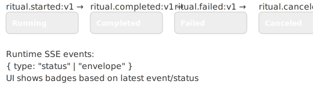

# Operate UI - Demon Meta-PaaS

A read-only web UI for monitoring and inspecting ritual runs in the Demon Meta-PaaS system.

## Overview

The Operate UI provides:
- **List View**: Recent ritual runs with status and basic information
- **Detail View**: Complete event timeline for individual runs
- **API Endpoints**: JSON APIs for programmatic access
- **Graceful Degradation**: Works even when JetStream is unavailable

## Features

- 📊 **Dashboard**: View recent runs at a glance
- 🔍 **Run Details**: Deep dive into event timelines
- 🚀 **Real-time Updates**: Auto-refresh for running rituals
- 📱 **Responsive Design**: Works on desktop and mobile
- 🛡️ **Error Handling**: Graceful fallbacks when services are unavailable
- 🔧 **Auto-Bootstrap**: Automatically creates required JetStream streams on startup
- 🔗 **API Access**: Full JSON API for integrations

## API Endpoints

### HTML Endpoints
- `GET /runs` - List recent runs (HTML)
- `GET /runs/:runId` - View run details (HTML)
- `GET /health` - Health check

### JSON API Endpoints
- `GET /api/runs?limit=50` - List recent runs (JSON)
- `GET /api/runs/:runId` - Get run details (JSON)

### API Response Formats

**List Runs Response:**
```json
[
  {
    "runId": "run-uuid",
    "ritualId": "my-ritual",
    "startTs": "2025-01-15T10:30:00Z",
    "status": "Completed"
  }
]
```

**Run Detail Response:**
```json
{
  "runId": "run-uuid",
  "ritualId": "my-ritual", 
  "events": [
    {
      "ts": "2025-01-15T10:30:00Z",
      "event": "ritual.started:v1",
      "stateFrom": null,
      "stateTo": "running"
    }
  ]
}
```

## Local Development

### Prerequisites

1. **Rust 1.82.0+** (configured in `rust-toolchain.toml`)
2. **NATS with JetStream** (optional - UI works without it)

### Setup

1. **Start NATS JetStream** (optional):
   ```bash
   make dev  # From project root
   ```

2. **Run the UI**:
   ```bash
   cd operate-ui
   cargo run
   ```

3. **Access the UI**:
   - Web UI: http://localhost:3000/runs
   - API: http://localhost:3000/api/runs
   - Health: http://localhost:3000/health

### Environment Variables

| Variable | Default | Description |
|----------|---------|-------------|
| `PORT` | `3000` | HTTP server port |
| `BIND_ADDR` | `0.0.0.0` | Bind address |
| `NATS_URL` | `nats://localhost:4222` | NATS server URL |
| `NATS_CREDS_PATH` | (none) | Path to NATS credentials file |
| `RITUAL_STREAM_NAME` | `RITUAL_EVENTS` | JetStream stream for ritual events. If unset, UI looks for `RITUAL_EVENTS` first, then falls back to `DEMON_RITUAL_EVENTS` (deprecated) and logs a warning. Stream will be auto-created if missing. |

### Development with NATS

```bash
# Terminal 1: Start NATS
make dev

# Terminal 2: Run some rituals to generate data
cargo run --bin demonctl -- run examples/rituals/minimal.yaml

# Terminal 3: Start the UI
cd operate-ui && cargo run

# Terminal 4: View the results
curl http://localhost:3000/api/runs
open http://localhost:3000/runs
```

### Development without NATS

The UI gracefully handles NATS being unavailable:

```bash
# Just run the UI directly
cd operate-ui && cargo run
open http://localhost:3000/runs
```

You'll see friendly error messages indicating that JetStream is unavailable.

## Testing

### Run All Tests
```bash
cargo test
```

### Run Unit Tests Only
```bash
cargo test --test unit
```

### Run E2E Tests
```bash
cargo test --test e2e
```

### Run Integration Tests (requires NATS)
```bash
# Start NATS first
make dev

# Run integration tests
cargo test -- --ignored
```

### Test Coverage
```bash
# Install cargo-tarpaulin if needed
cargo install cargo-tarpaulin

# Generate coverage report
cargo tarpaulin --out html
open tarpaulin-report.html
```

## Architecture

### Components

- **main.rs**: Server bootstrap and configuration
- **routes.rs**: HTTP handlers for HTML and JSON endpoints
- **jetstream.rs**: NATS JetStream client and data models
- **templates/**: Askama HTML templates

### Data Flow

1. **JetStream Events**: Ritual events are stored in JetStream on subjects like:
   ```
   demon.ritual.v1.<ritualId>.<runId>.events
   ```

2. **Query Layer**: The `jetstream.rs` module queries these subjects and transforms raw events into structured data models.

3. **HTTP Layer**: Routes in `routes.rs` handle incoming requests and render responses using either JSON serialization or HTML templates.

4. **UI Layer**: Askama templates provide responsive, accessible HTML with auto-refresh for running rituals.

### Mapping Note (Operate UI ↔ Runtime)

- Status mapping: the UI derives run badges from ritual event types
  - `ritual.started:v1` → Running
  - `ritual.completed:v1` → Completed
  - `ritual.failed:v1` → Failed
  - `ritual.canceled:v1` (when present) → Canceled
- SSE: the UI consumes `GET /api/runs/:runId/events/stream` (Operate UI) which mirrors runtime semantics; runtime’s SSE at
  `GET /api/v1/rituals/{ritual}/runs/{runId}/events/stream?app=…` emits `status` and (on completion) an `envelope` JSON event.
- Result envelope rendering: cards may refer to fields in the result envelope (produced by capsules) using manifest metadata;
  when an envelope isn’t available (e.g., canceled), the UI renders timeline/events only.



### Error Handling

- **Service Unavailable**: When NATS/JetStream is down, the UI shows helpful error messages
- **Missing Data**: When runs don't exist, appropriate 404s are returned
- **Timeouts**: All operations have defensive timeouts to prevent hanging
- **Graceful Degradation**: Core functionality works even with partial failures
- **Template Fallbacks**: If templates fail to load, minimal fallback templates prevent crashes
- **Stream Auto-Creation**: Missing JetStream streams are automatically created on startup

## Deployment

### Docker Build

Build the Docker image from the repository root:

```bash
# Build from the root directory (includes workspace dependencies)
docker build -f operate-ui/Dockerfile -t demon-operate-ui:latest .

# Run the container
docker run -p 3000:3000 \
  -e NATS_URL=nats://host.docker.internal:4222 \
  demon-operate-ui:latest

# Test the container
docker run --rm demon-operate-ui:latest /usr/local/bin/operate-ui
```

The Dockerfile uses a multi-stage build with:
- **Builder stage**: cargo-chef for dependency caching, Alpine-based Rust toolchain
- **Runtime stage**: Distroless static image (~33MB) with templates bundled
- **Security**: Runs as non-root user, static musl linking

### Configuration for Production

```bash
export PORT=8080
export BIND_ADDR=0.0.0.0
export NATS_URL=nats://nats-cluster:4222
export NATS_CREDS_PATH=/etc/nats/creds/operate-ui.creds
export RUST_LOG=operate_ui=info
export RITUAL_STREAM_NAME=RITUAL_EVENTS
```

## Contributing

1. Follow the existing code style (rustfmt)
2. Add tests for new features
3. Update this README for significant changes
4. Ensure all tests pass: `cargo test`

## Security Considerations

- **Read-Only**: This UI only reads from JetStream, never writes
- **No Authentication**: Currently no auth - add reverse proxy if needed
- **Input Validation**: All user inputs are validated and sanitized
- **DoS Protection**: Limits on query sizes and timeouts prevent abuse
